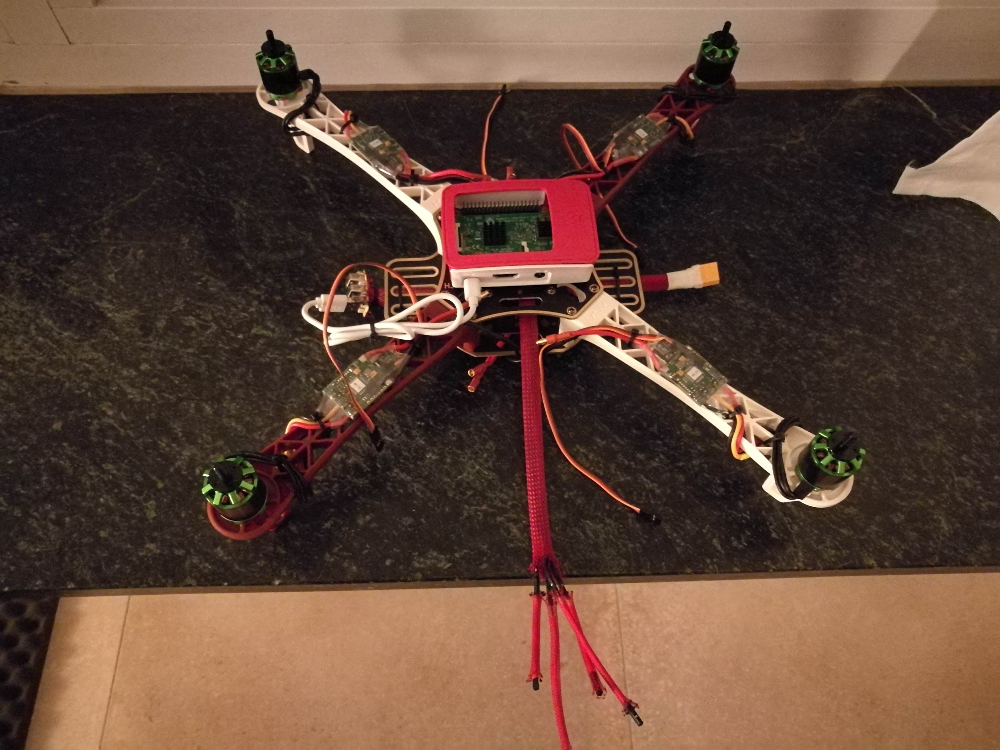

# PiPyFly
Create a Multicopter using a RaspberryPi

## Work in progress


## Setup
install the python package via ``` make install ```
__make sure to start the pigpiod daemon__ to be able to control the pins
which is included in the pigpio python module

for example you could put it in your /etc/rc.local file

    pigpiod -s 1

this will start the daemon with a sampling rate of 1 (the lowest possible)

## Tests
run the tests via ``` make test ```

## TODOs
* find a way to read the sensor data properly (data seems to be wrong)
* keep the low level layer (where one can change the throttle however one wants)
* add a higher level layer where each throttle change is checked and decided what to do with it
* add more unit tests for existing code (i.e. movements)
